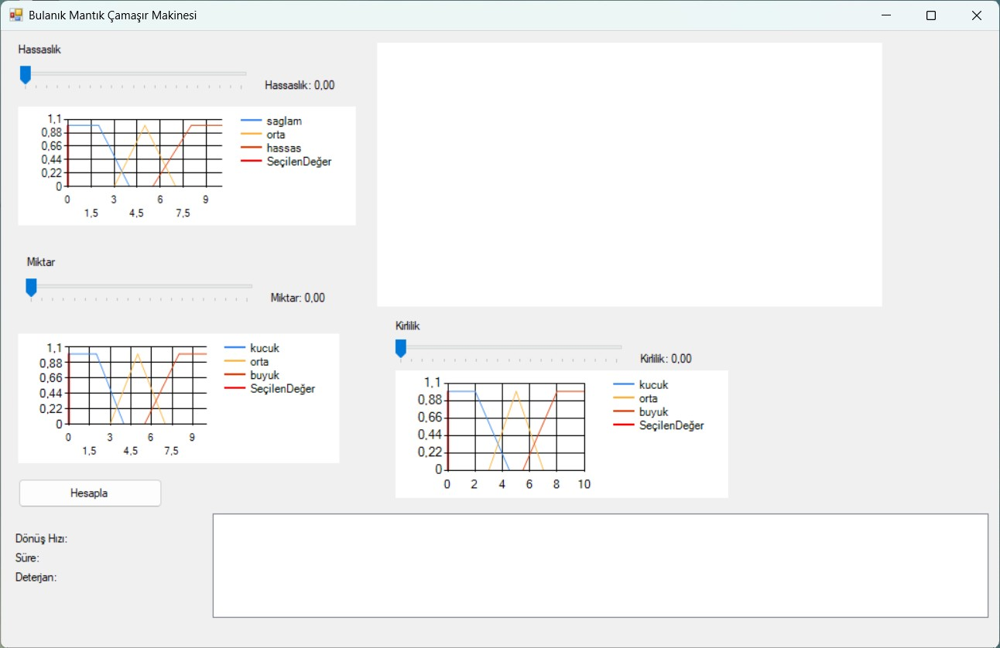

# 🧺 Bulanık Mantık Çamaşır Makinesi

Bu proje, **C# WinForms** kullanılarak geliştirilmiş,  
**bulanık mantık (fuzzy logic)** tabanlı bir çamaşır makinesi simülasyonudur.

Amaç; kullanıcıdan alınan belirsiz girdilere göre makinenin çalışma
parametrelerini akıllı bir şekilde belirlemektir.

---

## 📥 Girdiler
- 🧵 **Hassaslık**
- ⚖️ **Miktar**
- 🟤 **Kirlilik**

---

## 📤 Çıktılar
- 🔄 **Dönüş Hızı**
- ⏱️ **Süre**
- 🧴 **Deterjan Miktarı**

---

## 🖥️ Uygulama Arayüzü

---

## ▶️ Çalıştırma
1. `BulanikMantik.sln` dosyasını **Visual Studio** ile açın.
2. Projeyi **Build** edin ve çalıştırın.

---

## 📄 Lisans
Bu proje **MIT License** ile lisanslanmıştır.
